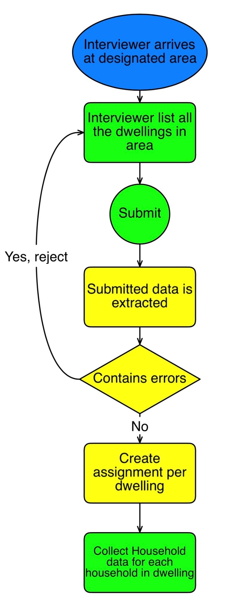
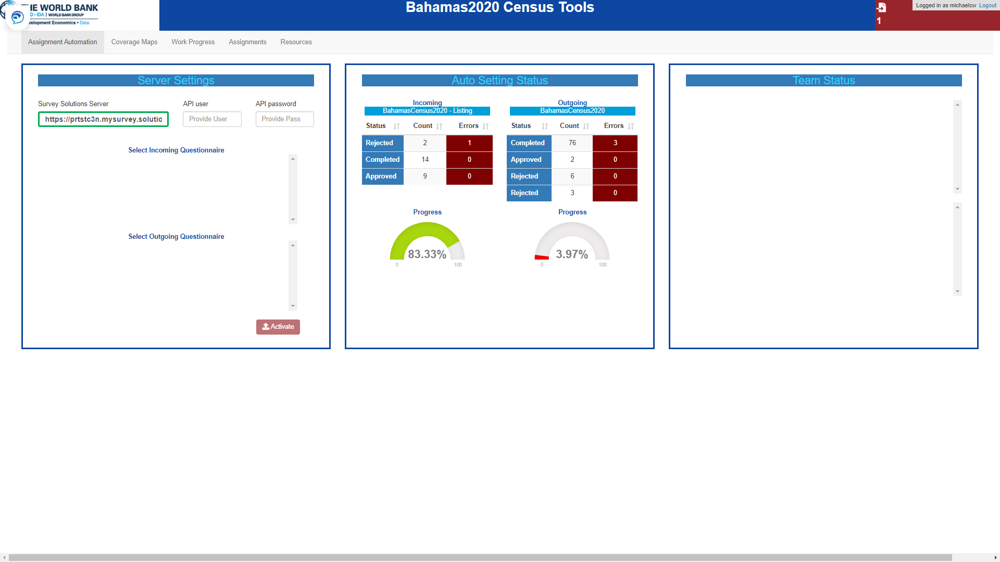

# Survey Solutions Dashboard Application

> This is an example [R Shiny](https://shiny.rstudio.com/) application on how to use the [Survey Solutions RESTful API](https://demo.mysurvey.solutions//apidocs/index#!), to **automate** and **monitor** the enumeration of structures and dwellings/households, either for census data collection, or ahead of a complex multi stage survey. Through the use of the Survey Solutions Computer Assisted Survey System (CASS) and the included geo-spatial features data collection also includes geo-referenced location data for each of the statistial units.

Access to the API is mostly managed by the [SurveySolutionsAPI](https://github.com/michael-cw/SurveySolutionsAPI) R package (currently only available on github).

You can use the application as is (in case you have a similar workflow) or modify the different components as required. The following documentation however, describes only the "as-is" set-up and operations, which among other things also requires the listing questionnaire to follow a partcular structure. Nevertheless i will point out the required changes for a customization in the set-up section.

Besides access to a Survey Solutions Server (which you can request [here](https://mysurvey.solutions/)), you will also require a key to [Google's maps API](https://cloud.google.com/maps-platform/) as well as an [ESRI license](https://developers.arcgis.com/pricing/licensing/) to access their maps API (required if you want to produce TPK files).

Since the application uses the Survey Solutions API (Application Programming Interface, used to connect third party Software to Survey Solutions), and is fully integrated with Survey Solutions through this API, we will also stick to the Survey Solutions terminology. This means:

- **Headquarter** refers to Survey Solutions Headquarters
- **Supervisor** refers to Survey Solutions Supervisors
- **Interviewer** refers to Survey Solutions Interviewers
- **Interview, Assignment etc.** as well.

For more details see [here](https://support.mysurvey.solutions/headquarters/accounts/teams-and-roles-tab-creating-user-accounts-/).

Finally this application was build in a Linux environment, and uses the [croneR package](https://cran.r-project.org/web/packages/cronR/vignettes/cronR.html) in case you want to run it in a Windows environment, you would need to rewrite the corresponding parts by using the [taskscheduleR package](https://cran.r-project.org/web/packages/taskscheduleR/readme/README.html).

## Covered Workflow

The main workflow underlying this application is outlined in the following flow diagram. 

It is based on two central assumptions:

1. Household listing (census or survey) and actuall data collection is carried out by the same team, and
2. listing and main data collection are carried out as one process.

To operate the current version, your listing questionnaire requires to follow the structure as used by [this questionnaire](https://designer.mysurvey.solutions/questionnaire/details/c831caadb2e043dd9db77f12d9797ddc/chapter/3b39162a571536708bd4db04c0cb935d/group/3b39162a571536708bd4db04c0cb935d) (requires a [Survey Solutions questionnaire designer access](https://designer.mysurvey.solutions/identity/account/login)).
To use the full extend of the geo-spatial features, you also require to have access to the area boundaries of the enumeration (listing) areas in the form of ESRI compatible shapefiles.

After successfully completing the listing, the interviewer submits the interview containing the enlisted structures/dwellings to the server. If this happens without error, the interviewer will receive - *through a second synchronization* - in return, a set of new assignments for each eligible dwellings (**in case of survey mode, a sample**). These new assignments also include the exact geo-referenced location for the structure in which the dwelling for the main enumeration is located. With this location information, the interviewer can subsequently navigate to the structure (i.e. by using Google maps, maps.me or any other navigation application), and conduct the enumeration (main interview) for each of the dwellings. 

To cover this workflow, the applications offers the following features:

- automation of quality control for listing operations
- automation of assignment creation from incoming listing data
- automation of sample creation for (household) surveys
- separation of automation script and application (for details see the corresponding section)
- continuous monitoring of the listing progress
- continuous monitoring of the listing data
- generation of reports for field teams
- automated procedures for quality control
- manual procedures of for quality control
- generation of base maps (requires ESRI license to access the )
- **census** or **sample mode**.

## Set-up

## Automation Script

## Operations

### Assignment Automation

After logging in, you will see the first Section "Assignment Automation". 

The left table and gauge in the center box shows the progress of the incoming (listing) data collection, the right table and gauge the progress for the outgoing (enumeration) questionnaire. This is it for this page, no other options are available to the monitoring user.

